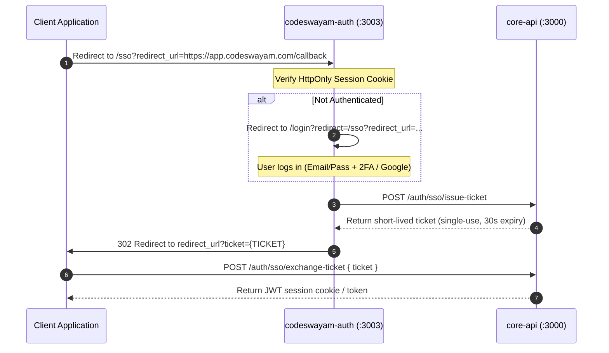

# CodeSwayam Auth (`codeswayam-auth`)


> **Centralized Authentication Hub, SSO Gateway, and Account Portal for the entire CodeSwayam platform.**

---

## Table of Contents

- [1. Architectural Overview](#1-architectural-overview)
- [2. System Architecture & SSO Flow](#2-system-architecture--sso-flow)
- [3. Codebase Organization & Folder Structure](#3-codebase-organization--folder-structure)
- [4. Design Patterns & SOLID Engineering](#4-design-patterns--solid-engineering)
- [5. Route & Component Inventory](#5-route--component-inventory)
- [6. Edge Middleware & Security Guards](#6-edge-middleware--security-guards)
- [7. Developer Guide: Adding New Pages & Features](#7-developer-guide-adding-new-pages--features)
- [8. Development & Verification](#8-development--verification)

---

## 1. Architectural Overview

`codeswayam-auth` is the mission-critical entry point for identity, authorization, billing, and subscription management across all CodeSwayam services (Web portal, IDE, Neural Web, Admin, and external client apps).

### Core Responsibilities

1. **Unified Identity & Access Management (IAM)**:
   - Multi-factor authentication (TOTP 2FA).
   - Email verification with automated 6-digit OTP issuance and verification.
   - Google OAuth integration with state and redirect integrity.
   - Session lifecycle management (active sessions list, device inspection, remote revocation).

2. **Cross-Domain SSO Gateway (`/sso`)**:
   - Short-lived ticket issuance and exchange.
   - Anti-phishing redirect validation against a dynamic trusted domain allowlist.
   - Automatic redirect loop guards to eliminate ping-pong authentication cycles.

3. **Customer Account Portal (`/account`)**:
   - Centralized account overview and real-time subscription status.
   - Plan lifecycle controls (upgrades, downgrades, cancellations, grace period renewals).
   - Visual expiration alerts with specialized indicators across all subscription views.
   - Wallet credits, transaction audit trail, and Razorpay pack checkout.
   - Invoicing, receipts, downloadable PDFs, and localized tax handling.
   - Push notifications (Web Push / VAPID) and user preference configuration.

---

## 2. System Architecture & SSO Flow

```
┌─────────────────────────────────────────────────────────────────────────┐
│                          CodeSwayam Ecosystem                           │
│                                                                         │
│   ┌──────────────┐       ┌──────────────┐       ┌──────────────────┐    │
│   │ codeswayam-  │       │ codeswayam-  │       │   neural-web /   │    │
│   │    web       │       │    admin     │       │   external apps  │    │
│   └──────┬───────┘       └──────┬───────┘       └─────────┬────────┘    │
│          │                      │                         │             │
│          └──────────────────────┼─────────────────────────┘             │
│                                 ▼                                       │
│                Unauthenticated Redirect to /sso                         │
│                                 │                                       │
│                                 ▼                                       │
│               ┌───────────────────────────────────┐                     │
│               │       codeswayam-auth (:3003)      │                     │
│               │                                   │                     │
│               │   ┌───────────────┐ ┌─────────┐   │                     │
│               │   │ /login        │ │ /sso    │   │                     │
│               │   │ /signup       │ │ (Ticket │   │                     │
│               │   │ /2fa          │ │  Issuer)│   │                     │
│               │   └───────┬───────┘ └────┬────┘   │                     │
│               │           │              │        │                     │
│               │           ▼              ▼        │                     │
│               │   ┌───────────────────────────┐   │                     │
│               │   │ /account & /dashboard     │   │                     │
│               │   │ Subscriptions · Credits   │   │                     │
│               │   │ Invoices · Security       │   │                     │
│               │   └───────────────────────────┘   │                     │
│               └─────────────────┬─────────────────┘                     │
│                                 │                                       │
│                SSO Ticket Issued (30s TTL)                              │
│                                 ▼                                       │
│               ┌───────────────────────────────────┐                     │
│               │             core-api              │                     │
│               │ Ticket verification & session mint│                     │
│               └───────────────────────────────────┘                     │
└─────────────────────────────────────────────────────────────────────────┘
```

### SSO Ticket Lifecycle



---

## 3. Codebase Organization & Folder Structure

The codebase strictly adheres to the **Thin Orchestrator & Feature Co-location** standard. Route handlers (`page.tsx`) do not contain massive inline UI blocks; instead, each page delegates to focused sub-components co-located in `_components/`.

```
codeswayam-auth/
├── app/
│   ├── (auth)/                          # Unauthenticated authentication routes
│   │   ├── login/
│   │   │   ├── page.tsx                 # Thin orchestrator (auth checks, routing)
│   │   │   └── _components/
│   │   │       ├── LoginForm.tsx        # Email/password + Google auth form
│   │   │       ├── VerificationNeededBanner.tsx  # Fresh OTP input & resend
│   │   │       ├── TwoFactorChallenge.tsx        # TOTP authenticator code challenge
│   │   │       ├── ErrorAlert.tsx       # Standardized form error alert
│   │   │       └── index.ts             # Clean public barrel export
│   │   └── signup/
│   │       ├── page.tsx                 # Thin orchestrator (redirects, source tagging)
│   │       └── _components/
│   │           ├── SignupForm.tsx       # Registration form with referral codes
│   │           ├── EmailVerificationPending.tsx  # Post-signup OTP verification
│   │           └── index.ts
│   │
│   ├── account/                         # Authenticated Customer Portal
│   │   ├── layout.tsx                   # Thin Layout Orchestrator & Context Provider
│   │   ├── page.tsx                     # Thin Overview Orchestrator
│   │   ├── _components/                 # Shared Account Layout & Overview Components
│   │   │   ├── AccountHeader.tsx        # Sticky top navigation with user menu
│   │   │   ├── AccountSidebar.tsx       # Desktop vertical sidebar with admin links
│   │   │   ├── MobileNav.tsx            # Sticky horizontal mobile navigation
│   │   │   ├── AccountStatusBanner.tsx  # Suspension/rejection alert banners
│   │   │   ├── nav-items.ts             # Navigation schema & role permissions
│   │   │   ├── OverviewHero.tsx         # Welcome hero banner
│   │   │   ├── OverviewStats.tsx        # Stat cards (active apps, monthly spend, credits)
│   │   │   ├── OverviewActiveSubscriptions.tsx # Expired-aware grouped subscription list
│   │   │   ├── GettingStartedCard.tsx   # Quick start guide
│   │   │   └── index.ts
│   │   │
│   │   ├── activity/
│   │   │   ├── page.tsx                 # Activity Log Orchestrator
│   │   │   └── _components/             # ActivityRow, ActivityStats, ActivityHeader, Pagination
│   │   ├── apps/
│   │   │   ├── page.tsx                 # Subscribed Apps Orchestrator
│   │   │   └── _components/             # AppCard, AppUsageMeters, AppsStats, AppsHeader
│   │   ├── billing/
│   │   │   ├── page.tsx                 # Billing & Payment Orchestrator
│   │   │   └── _components/             # StatCard, StatusBadge, InvoiceRow, BillingFaqCard
│   │   ├── credits/
│   │   │   ├── page.tsx                 # Credits & Wallet Orchestrator
│   │   │   └── _components/             # PackCard, TxRow, CreditsTrustNote
│   │   ├── notifications/
│   │   │   ├── page.tsx                 # Notifications Orchestrator
│   │   │   └── _components/             # NotifRow, NotifHeader, NotifFilterTabs
│   │   ├── preferences/
│   │   │   ├── page.tsx                 # User Preferences Orchestrator
│   │   │   └── _components/             # NotificationPreferences, Localization, Theme, DangerZone
│   │   ├── profile/
│   │   │   ├── page.tsx                 # User Profile Orchestrator
│   │   │   └── _components/             # ProfileInfoCard, AvatarUpload, SubscriptionSummary
│   │   ├── referrals/
│   │   │   ├── page.tsx                 # Referral System Orchestrator
│   │   │   └── _components/             # ReferralCodeBox, RedeemCodeForm, Stats, HistoryTable
│   │   ├── security/
│   │   │   ├── page.tsx                 # Security Orchestrator
│   │   │   └── _components/             # PasswordSection, TwoFactorSection, SessionsSection
│   │   └── subscriptions/
│   │       ├── page.tsx                 # Subscriptions Orchestrator
│   │       └── _components/             # SubscriptionCard, UpgradeModal, CancelDialog, StatusPill
│   │
│   ├── dashboard/
│   │   ├── page.tsx                     # Catalog & Product Hub Orchestrator
│   │   └── _components/                 # ProductCard, BundleCard, FilterBar
│   │
│   ├── invoices/
│   │   ├── page.tsx                     # Invoices List Orchestrator
│   │   └── _components/                 # InvoiceItemRow, InvoicesStats, InvoicesHeader, FilterTabs
│   │
│   └── sso/
│       └── page.tsx                     # SSO Ticket issuance handler
│
├── components/                          # Cross-route global components
│   ├── ui/                              # Shadcn UI primitives (Button, Card, Input, etc.)
│   ├── brand-loader.tsx                 # Branded animated loader
│   ├── navbar.tsx                       # Public header
│   └── providers.tsx                    # Theme and OAuth context wrappers
│
├── lib/                                 # Platform utilities & API client
│   ├── api.ts                           # Typed API client functions
│   ├── auth-redirect.ts                 # Safe redirection and auth token verification
│   ├── domains.ts                       # Dynamic trusted domain allowlist resolution
│   └── signup-source.ts                 # Attribution query parameter parsing
│
├── types/                               # Centralized TypeScript Contracts
│   ├── subscription.ts                  # BillingCycle, PlanTier, PublicProduct, PublicBundle
│   └── index.ts
│
└── middleware.ts                        # Edge route guarding, loop-protection, and token checking
```

---

## 4. Design Patterns & SOLID Engineering

Every file and component in `codeswayam-auth` is built around industry-standard software engineering principles:

### 1. Single Responsibility Principle (SRP)
- **Thin Orchestrators (`page.tsx`)**: Responsible **only** for data retrieval, top-level hook orchestration, error handling, and component assembly.
- **Dedicated Components (`_components/*.tsx`)**: Responsible **only** for rendering their specific domain slice (e.g., `PasswordSection` manages only password changing; `AppUsageMeters` handles only meter visual state).

### 2. Open / Closed Principle (OCP)
- Adding new tabs, settings categories, or stat metrics is achieved by authoring new modular files under `_components/` without modifying or endangering existing components.
- Metadata maps (e.g. `NOTIF_META`, `STATUS_STYLES`, `TIER_COLORS`) drive icon and color formatting declaratively rather than using sprawling inline conditional checks.

### 3. Dependency Inversion Principle (DIP)
- Pure UI components depend upon typed interfaces (`types/`) rather than ad-hoc page-level types.
- Remote operations are routed through centralized API abstractions (`@/lib/api`) rather than raw inline `fetch` calls.

### 4. Visual Expiration Highlighting Pattern (Expired Status)
Subscription items across `subscriptions/`, `profile/`, `apps/`, and `account/page.tsx` utilize centralized expiration detection:
- Subscriptions whose `expiresAt` is in the past are highlighted with red-tinted backgrounds (`#fff5f5`), border accents (`#fca5a5`), line-through on plan names, and direct "Renew" call-to-action buttons.

---

## 5. Route & Component Inventory

| Route | Protection | Orchestrator | Primary Sub-Components (`_components/`) |
|---|---|---|---|
| `/login` | Public (Bounces if authed) | `app/login/page.tsx` | `LoginForm`, `VerificationNeededBanner`, `TwoFactorChallenge`, `ErrorAlert` |
| `/signup` | Public (Bounces if authed) | `app/signup/page.tsx` | `SignupForm`, `EmailVerificationPending` |
| `/account` | 🔒 Protected | `app/account/page.tsx` | `OverviewHero`, `OverviewStats`, `OverviewActiveSubscriptions`, `GettingStartedCard` |
| `/account/subscriptions` | 🔒 Protected | `app/account/subscriptions/page.tsx` | `SubscriptionCard`, `SubscriptionGroup`, `PastSubscriptionRow`, `UpgradeModal`, `CancelDialog` |
| `/account/profile` | 🔒 Protected | `app/account/profile/page.tsx` | `ProfileInfoCard`, `AvatarUpload`, `SubscriptionSummary`, `AccountStatusCard`, `DangerZone` |
| `/account/security` | 🔒 Protected | `app/account/security/page.tsx` | `PasswordSection`, `TwoFactorSection`, `SessionsSection` |
| `/account/billing` | 🔒 Protected | `app/account/billing/page.tsx` | `StatCard`, `StatusBadge`, `InvoiceRow`, `BillingFaqCard`, `RazorpayNoteCard` |
| `/account/credits` | 🔒 Protected | `app/account/credits/page.tsx` | `PackCard`, `TxRow`, `CreditsTrustNote` |
| `/account/apps` | 🔒 Protected | `app/account/apps/page.tsx` | `AppCard`, `AppUsageMeters`, `AppsHeader`, `AppsStats` |
| `/account/activity` | 🔒 Protected | `app/account/activity/page.tsx` | `ActivityRow`, `ActivityStats`, `ActivityHeader`, `ActivityPagination` |
| `/account/referrals` | 🔒 Protected | `app/account/referrals/page.tsx` | `ReferralHeader`, `ReferralCodeBox`, `RedeemCodeForm`, `ReferralStatsCards`, `RedemptionHistoryTable` |
| `/account/preferences` | 🔒 Protected | `app/account/preferences/page.tsx` | `NotificationPreferencesCard`, `LocalizationCard`, `ThemeCard`, `DataManagementCard`, `DangerZoneCard` |
| `/dashboard` | 🔒 Protected | `app/dashboard/page.tsx` | `ProductCard`, `BundleCard`, `FilterBar` |
| `/invoices` | 🔒 Protected | `app/invoices/page.tsx` | `InvoiceItemRow`, `InvoicesStats`, `InvoicesHeader`, `InvoicesFilterTabs` |

---

## 6. Edge Middleware & Security Guards

The Edge Middleware (`middleware.ts`) protects all routes before requests enter the Next.js React render tree:

```
Incoming Request
       │
       ▼
Is path /sso? ────────────► YES ──► Allow through (Always open for ticket issuance)
       │
       NO
       ▼
Is path protected?
(/account, /dashboard, /invoices, /profile)
       │
      YES ──► Has valid session cookie?
                   │
                   NO  ──► Redirect to /login?redirect=<safe_current_url>
                   YES ──► Allow through
       │
       NO
       ▼
Is path an auth route? (/login, /signup)
       │
      YES ──► Has valid session cookie?
                   │
                   YES ──► Check loop guard & redirect to target app or /dashboard
                   NO  ──► Allow through
       │
       NO
       ▼
Allow through (Public landing & marketing pages)
```

### Loop Guard
Before issuing any 302 redirect back to the originating client app, the redirect target URL is validated:
1. Target hostname cannot match `auth.codeswayam.com` or create an infinite loop.
2. Target hostname must be in the trusted domain allowlist (`localhost`, `*.codeswayam.com`, or database-registered enterprise SSO domains).

---

## 7. Developer Guide: Adding New Pages & Features

When adding a new page or extending existing functionality, follow this standard pattern:

### Step 1: Establish Types
Place all domain-specific data models in `types/` or a local `_components/types.ts` file:
```typescript
// types/my-feature.ts
export interface FeatureItem {
  id: string;
  name: string;
  enabled: boolean;
}
```

### Step 2: Create Sub-Components in `_components/`
Build single-responsibility components with strict prop contracts:
```typescript
// app/account/my-feature/_components/FeatureCard.tsx
"use client";

import React from "react";
import type { FeatureItem } from "@/types";

export function FeatureCard({ item }: { item: FeatureItem }) {
  return (
    <div className="p-4 border rounded-xl bg-white shadow-sm">
      <h3 className="text-sm font-bold text-gray-900">{item.name}</h3>
    </div>
  );
}
```

### Step 3: Export via Barrel File
```typescript
// app/account/my-feature/_components/index.ts
export * from "./FeatureCard";
```

### Step 4: Write Thin Page Orchestrator
```typescript
// app/account/my-feature/page.tsx
"use client";

import { useEffect, useState } from "react";
import { FeatureCard } from "./_components";
import type { FeatureItem } from "@/types";

export default function MyFeaturePage() {
  const [items, setItems] = useState<FeatureItem[]>([]);
  const [loading, setLoading] = useState(true);

  useEffect(() => {
    // Fetch data via @/lib/api
    setLoading(false);
  }, []);

  return (
    <div className="space-y-6">
      {items.map((item) => (
        <FeatureCard key={item.id} item={item} />
      ))}
    </div>
  );
}
```

---

## 8. Development & Verification

### Local Setup
```bash
# Install dependencies
npm install

# Run development server on port 3003
npm run dev
```

### Type Checking & Build Validation
```bash
# Run strict TypeScript compilation check (0 errors required)
npx tsc --noEmit

# Test production build
npm run build
```
